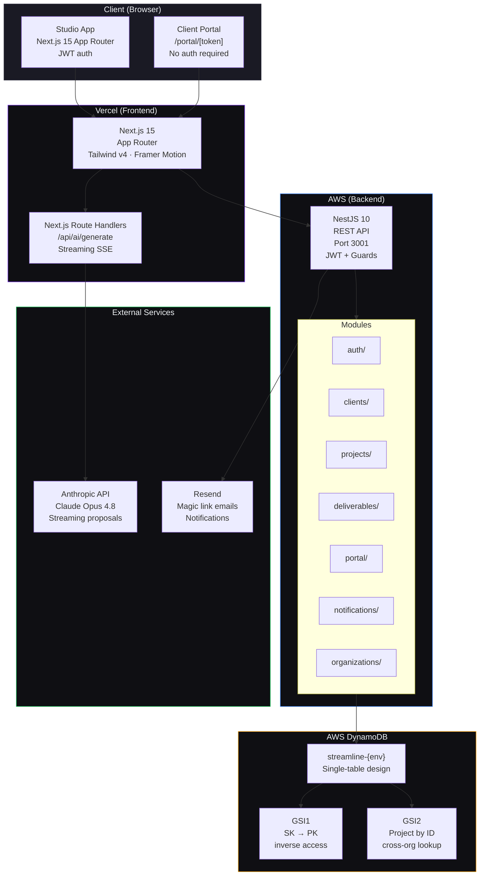
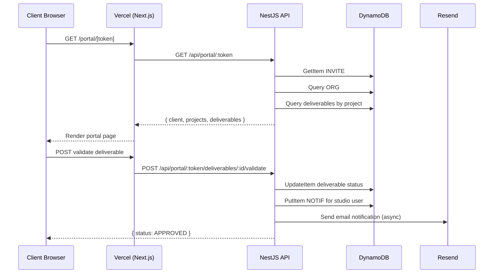
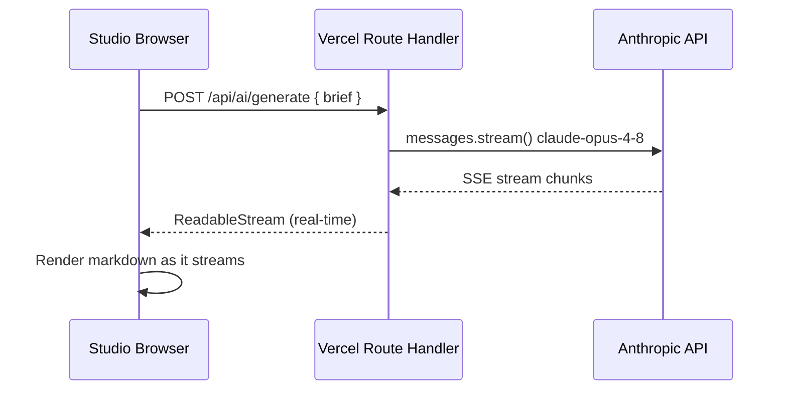
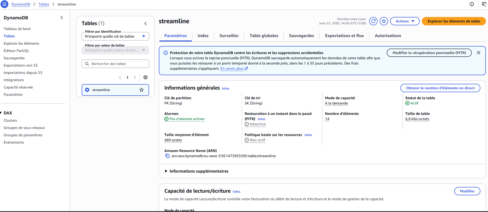
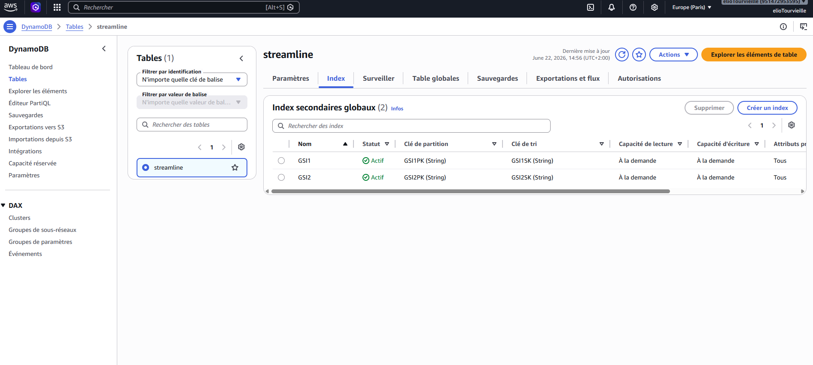

# StreamLine — System Architecture

## Overview

## DynamoDB Single-Table Design

One table (`streamline-{env}`) stores all entities using composite PK/SK keys.

| PK | SK | Entity |
|----|----|--------|
| `ORG#{orgId}` | `METADATA` | Organisation |
| `ORG#{orgId}` | `CLIENT#{clientId}` | Client |
| `ORG#{orgId}` | `PROJECT#{projectId}` | Project (list view) |
| `PROJECT#{projectId}` | `METADATA` | Project detail + milestones |
| `PROJECT#{projectId}` | `DELIVERABLE#{id}` | Deliverable |
| `PROJECT#{projectId}` | `MSG#{iso}#{uuid}` | Chat message |
| `USER#{userId}` | `METADATA` | User profile |
| `USER#{userId}` | `NOTIF#{iso}#{uuid}` | Notification |
| `INVITE#{token}` | `METADATA` | Portal invite (TTL 90d) |

### Access patterns

- **Studio dashboard** → `ORG#x | begins_with(PROJECT#)` via base table
- **Project detail** → `GSI2: PROJECT#x` (cross-org lookup by project ID)
- **Client projects** → `GSI1: CLIENT#x | begins_with(PROJECT#)`
- **Notifications** → `USER#x | begins_with(NOTIF#)` newest-first
- **Messages** → `PROJECT#x | begins_with(MSG#)` chronological

## Request Flow — Client Portal Validation

## Request Flow — AI Proposal Generator

---

## AWS Setup Required

> **For H0 submission:** Two screenshots from the AWS Console (eu-west-3).

### Table overview (Paramètres tab)

### GSI indexes (Index tab)

